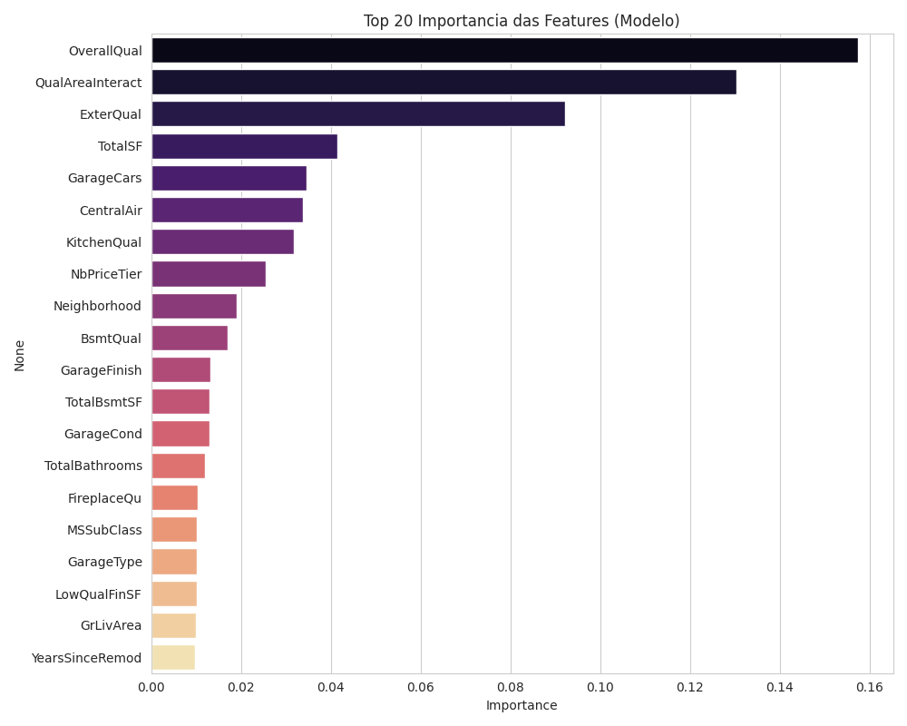
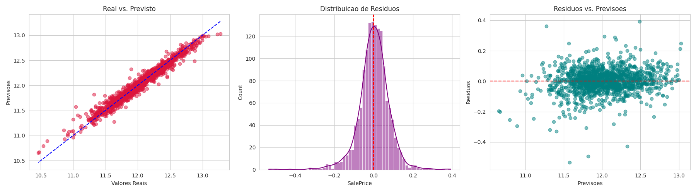
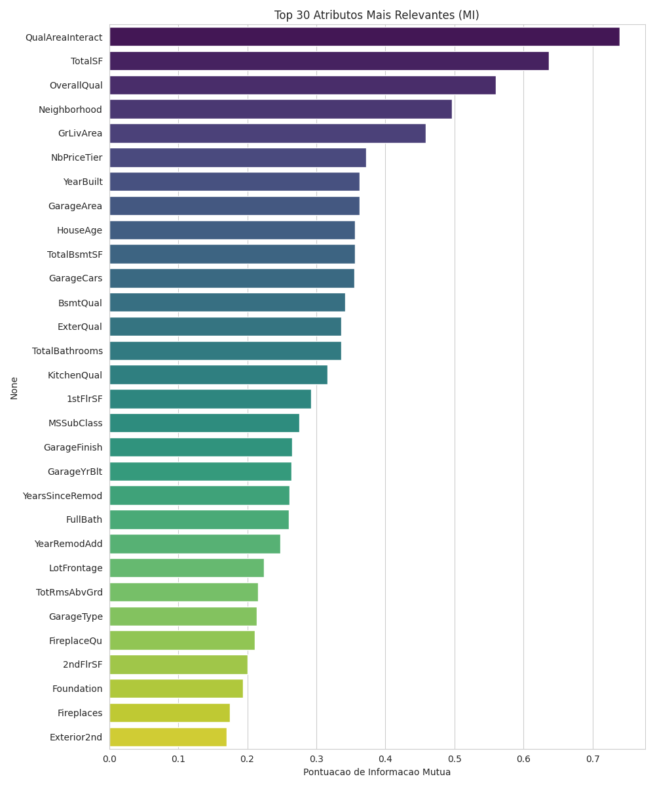
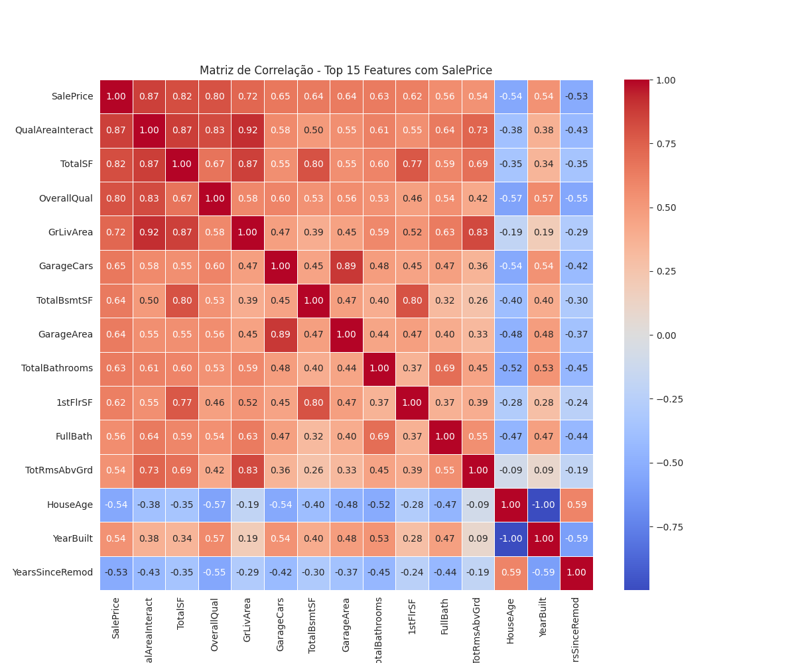

# 🏠 House Price Discovery & Mining (DM)

A robust, end-to-end Data Science pipeline for predicting house prices and discovering hidden patterns in real estate data. This project goes beyond simple regression by incorporating **Frequent Pattern Mining** and **Segmented Error Analysis** to provide actionable business insights.

[](https://www.python.org/downloads/)
[](https://opensource.org/licenses/MIT)

## 🎯 Project Overview

This repository implements a modular pipeline to solve the classic Ames Housing dataset problem. The goal is twofold:
1.  **Predictive Modeling**: Achieve high accuracy in house price estimation using XGBoost.
2.  **Insight Discovery**: Use Association Rules and Sequential Patterns to understand what combinations of features drive high-value sales.

### 🏆 Key Results & Performance Scorecard

| Metric | Cross-Validation (10-Fold) | Final Model (Training Set) |
| :--- | :--- | :--- |
| **R² Score** | **0.9062** | 0.9852 |
| **RMSE (log)** | **0.1171** | 0.0781 |
| **MAE (Log)** | 0.0812 | 0.0559 |
| **MAE (Original)** | **$12,591.97** | $8,842.10 |

> **Note**: Cross-Validation metrics are the most reliable indicators of real-world performance. The Final Model metrics show the fit on the training data used for the Kaggle submission.

#### 📉 Error Analysis by Price Segment
The model exhibits high stability across most price ranges, with a slight increase in relative error for the lowest decile (D1), as shown in our segment analysis:

| Price Decile | Avg Log Error | MAE ($) |
| :--- | :--- | :--- |
| **D1 (Cheapest 10%)** | 0.095 | $8,378 |
| **D5 (Median)** | 0.051 | $7,952 |
| **D10 (Most Expensive 10%)** | 0.063 | $20,958 |

**Primary Price Drivers**: `OverallQual` (17.6%), `QualAreaInteract` (13.2%), and `ExterQual` (5.4%).

---

## 🚀 Key Features

### 🛠️ Advanced Data Engineering
- **Robust Imputation**: Neighborhood-based median imputation for `LotFrontage` and logical fill-ins for categorical features (e.g., 'NA' for houses without garages).
- **Multivariate Outlier Detection**: Combines domain-specific rules with **Isolation Forest** to ensure high-quality training data.
- **Smart Feature Engineering**: 
    - `QualAreaInteract`: Captures the non-linear relationship between quality and living area (Top predictor).
    - `NbPriceTier`: Groups 25+ neighborhoods into 5 distinct price levels.
    - `TotalSF`: Combined square footage of basement and upper floors.
    - `TotalBathrooms` & `HouseAge`: Consolidated metrics for better model performance.

### 🔍 Discovery Mining (DM)
- **Association Rules (Apriori)**:
    - *Rule*: (GarageCars=Alto, QualAreaInteract=Muito Alto) → (SalePrice=Muito Alto) | **Lift: 7.51**
    - *Rule*: (TotalBsmtSF=Muito Alto, QualAreaInteract=Muito Alto) → (SalePrice=Muito Alto) | **Lift: 6.22**
- **Sequential Patterns (PrefixSpan)**: Analyzes the "evolutionary patterns" of house attributes across different construction decades.
- **Market Segmentation**: Market split into 5 distinct clusters using **K-Means**.

---

## 📁 Project Structure

```text
├── data/
│   ├── raw/                # Original train/test files
│   └── processed/          # Final submission.csv
├── notebooks/              # Experimental EDA and Mining (Jupyter)
├── reports/
│   ├── figures/            # Exported charts (Correlation, MI, Features)
│   └── execution_log_*.txt # Detailed logs of every pipeline run
├── src/
│   ├── cleaning.py         # Imputation, Outliers, Feature Engineering
│   ├── mining.py           # Apriori, PrefixSpan, Clustering
│   ├── models.py           # XGBoost training and evaluation
│   └── utils.py            # Visualization and helper functions
├── main.py                 # Main orchestrator (Entry point)
└── requirements.txt        # Dependencies
```

---

## 🛠️ Installation & Usage

1. **Clone the repository**:
   ```bash
   git clone https://github.com/Kemuel-M/House-Price-Discovery-Mining-DM.git
   cd House-Price-Discovery-Mining-DM
   ```

2. **Install dependencies**:
   ```bash
   pip install -r requirements.txt
   ```

3. **Run the full pipeline**:
   ```bash
   python main.py
   ```
   *This will execute the entire process: cleaning, EDA, mining, training, and generating a Kaggle-ready `submission.csv`.*

---

## 📊 Visualizations

<p align="center">
  
  
</p>

<p align="center">
  
  
</p>

---

## ✉️ Contact
Created by [Kemuel Marvila](https://github.com/Kemuel-M/) - feel free to reach out for collaborations or inquiries!
